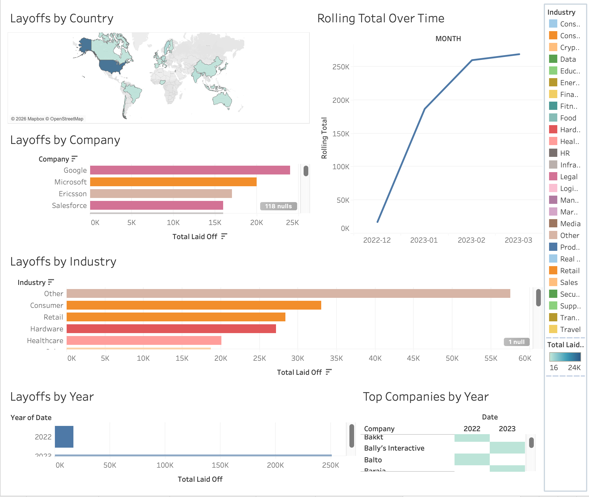

# Global Layoffs Data Analysis (SQL + Tableau)

##  Overview
This project analyzes global layoffs data using SQL for data exploration and Tableau for visualization and storytelling.

##  Objective
To identify trends in layoffs across companies, industries, countries, and time, and present insights through an interactive dashboard.

##  Tools Used
- SQL (MySQL)
- Tableau Public
- Excel (for preprocessing)

##  Dataset
The dataset includes:
- Company
- Industry
- Country
- Total layoffs
- Percentage laid off
- Date

##  Data Analysis (SQL)
Performed exploratory data analysis using:
- Aggregations (SUM, MAX)
- Grouping (company, industry, country)
- Date analysis (year, month)
- CTEs and window functions

Key analysis:
- Total layoffs by company
- Layoffs by industry and country
- Yearly and monthly trends
- Rolling cumulative layoffs over time

##  Tableau Dashboard
 **Live Dashboard:**  
 https://public.tableau.com/app/profile/ifesola.fadare/viz/WorldLayoffsExploratoryAnalysis/WorldLayoffsExploratoryAnalysis?publish=yes

##  Key Insights
- Certain companies contributed disproportionately to total layoffs
- Layoffs peaked during specific economic periods
- Tech and related industries showed significant impact
- Rolling trends highlight cumulative economic impact over time

##  Dashboard Preview

##  Project Structure
- `/data` → dataset  
- `/sql` → SQL queries  
- `/images` → dashboard visuals  

##  Skills Demonstrated
- SQL data analysis (GROUP BY, CTEs, window functions)
- Data storytelling with Tableau
- Trend analysis and business insights
- Dashboard design and visualization

##  What I Learned
- How to transform raw data into insights
- How to connect SQL analysis with visualization tools
- How to present data in a clear and actionable way
